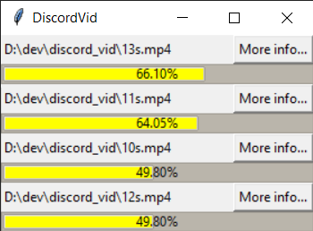
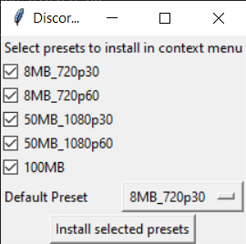
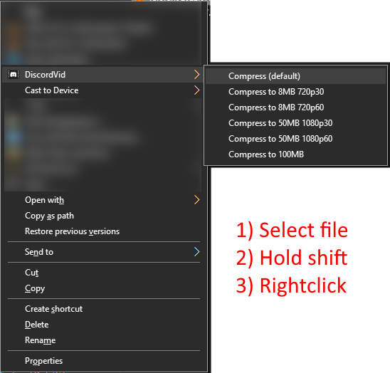

# Discord Video Resizer

Calculate and forward FFMPEG commands, staying under Discords 8MB limit.
Supports multiple files at the same time, as well as automatically using CPU vs NVENC encoding

# Installation
Download the latest version from:

https://github.com/alex-ong/discord_vid/releases/

1. Unzip the folder somewhere useful.
2. Run `install.bat`
3. Select which presets you want in your `shift+rightclick` context menu
4. Select the default preset you want to compress to
5. Click "Install selected presets" and press yes a few times

This will add a `shift+right click` context menu

# Usage

1. Select a video file in explorer
2. Hold shift
3. Right click
4. Select the preset you want

# Presets

Presets can be modified by going to `data/USER_CONFIG.json` after running the application once.
